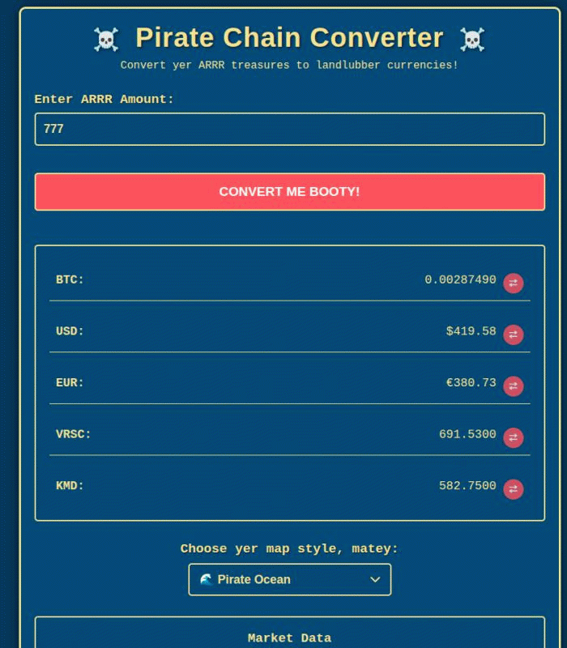

# 🏴‍☠️ Pirate Chain Converter


A responsive, interactive cryptocurrency converter specializing in Pirate Chain (ARRR) conversions. This tool allows users to convert ARRR to various cryptocurrencies and fiat currencies with a pirate-themed interface and multiple visual themes.



## 🌟 Features

- **Multi-currency Conversion**: Convert ARRR to BTC, USD, EUR, VRSC, KMD, and more
- **Bi-directional Conversion**: Convert from any supported currency to ARRR
- **Pirate-themed UI**: Seven different visual themes
- **Responsive Design**: Works on desktop, tablet, and mobile devices
- **Lucky 777 Easter Egg**: Special animation when converting 777 ARRR
- **Embedding Support**: Add the converter to your own website
- **Theme Persistence**: Saves user's theme preference
- **Market Data Display**: Shows latest market statistics

## 📋 Table of Contents

- [Installation](#-installation)
- [Usage](#-usage)
- [CoinGecko API Integration](#-coingecko-api-integration)
- [Customization](#-customization)
- [Themes](#-themes)
- [Contributing](#-contributing)
- [License](#-license)
- [Contact](#-contact)

## 🔧 Installation

1. Clone the repository:
   ```bash
   git clone https://github.com/zseko/pirate-chain-converter.git
   cd pirate-chain-converter
   ```

2. No build process is required. You can run it directly by opening `index.html` in a browser, or use a simple HTTP server:
   ```bash
   # Using Python
   python -m http.server

   # Using Node.js and npm
   npx serve
   ```

3. For production, upload the files to your web hosting service.

## 🚀 Usage

### Basic Conversion
1. Enter the amount of ARRR in the input field
2. The equivalent amounts in other currencies appear instantly
3. Click the "Convert Me Booty!" button to refresh calculations

### Reverse Conversion
1. Click the swap button (⇄) next to any currency
2. The input field will now accept that currency
3. Enter an amount to see the equivalent in ARRR and other currencies

### Change Theme
- Select a theme from the dropdown menu to change the visual appearance
- Your selected theme will be saved for future visits

### Embed on Your Website
1. Copy the embed code from the "Embed On Your Website" section
2. Paste it into your website's HTML
3. Update the source URL to point to your hosted version

## 🔌 CoinGecko API Integration

This project currently uses hardcoded exchange rates. To implement real-time rates using the CoinGecko API:

### Step 1: Register for CoinGecko API (Optional for Basic Usage)
- CoinGecko offers a free API tier with rate limits
- For higher limits, register at [CoinGecko](https://www.coingecko.com/en/api)

### Step 2: Create a new API handler file
Create a new file called `api.js` with this structure:

```javascript
// CoinGecko API integration
const API = {
    // Base URL for CoinGecko API
    baseUrl: 'https://api.coingecko.com/api/v3',
    
    // Get exchange rates for ARRR
    async getArrrRates() {
        try {
            // Get ARRR to USD rate
            const response = await fetch(`${this.baseUrl}/simple/price?ids=pirate-chain&vs_currencies=usd,eur,btc&include_24hr_vol=true&include_market_cap=true`);
            const data = await response.json();
            
            if (!data['pirate-chain']) {
                throw new Error('Failed to fetch ARRR data');
            }
            
            // Get conversion rates for VRSC and KMD
            const verusResponse = await fetch(`${this.baseUrl}/simple/price?ids=verus-coin,komodo&vs_currencies=usd`);
            const verusData = await verusResponse.json();
            
            // Calculate the conversion rates
            const rates = {
                ARRR_TO_USD: data['pirate-chain'].usd,
                ARRR_TO_EUR: data['pirate-chain'].eur,
                ARRR_TO_BTC: data['pirate-chain'].btc,
                // Calculate VRSC rate through USD
                ARRR_TO_VRSC: verusData['verus-coin'] ? data['pirate-chain'].usd / verusData['verus-coin'].usd : 0.89,
                // Calculate KMD rate through USD
                ARRR_TO_KMD: verusData['komodo'] ? data['pirate-chain'].usd / verusData['komodo'].usd : 0.75,
                // Additional market data
                MARKET_CAP: data['pirate-chain'].usd_market_cap,
                VOLUME_24H: data['pirate-chain'].usd_24h_vol
            };
            
            return rates;
        } catch (error) {
            console.error('Error fetching exchange rates:', error);
            // Return default rates as fallback
            return {
                ARRR_TO_BTC: 0.0000037,
                ARRR_TO_USD: 0.54,
                ARRR_TO_EUR: 0.49,
                ARRR_TO_VRSC: 0.89,
                ARRR_TO_KMD: 0.75,
                MARKET_CAP: 99347890,
                VOLUME_24H: 432875
            };
        }
    }
};

export default API;
```

### Step 3: Update script.js to use the API

Modify `script.js` by adding these changes:

1. Import the API module at the top of the file:
```javascript
import API from './api.js';
```

2. Update the initialization function to fetch rates:
```javascript
// Initialize
async function initializeApp() {
    // Set up event listeners
    setupEventListeners();
    
    // Fetch exchange rates from API
    try {
        const updatedRates = await API.getArrrRates();
        // Update the exchange rates
        Object.assign(exchangeRates, updatedRates);
        
        // Update market data display
        updateMarketData(updatedRates);
    } catch (error) {
        console.error('Failed to fetch rates, using default values:', error);
        showToast('Using default exchange rates');
    }
    
    // Update last updated date
    updateLastUpdatedDate();
    
    // Initial conversion
    doConvert();
    
    // Check for theme in local storage
    loadSavedTheme();
}
```

3. Add function to update market data display:
```javascript
function updateMarketData(rates) {
    // Update market data display
    const marketCapElement = document.getElementById('market-cap');
    const volumeElement = document.getElementById('volume-24h');
    
    if (marketCapElement && rates.MARKET_CAP) {
        marketCapElement.textContent = '$' + formatLargeNumber(rates.MARKET_CAP);
    }
    
    if (volumeElement && rates.VOLUME_24H) {
        volumeElement.textContent = '$' + formatLargeNumber(rates.VOLUME_24H);
    }
}

function formatLargeNumber(num) {
    if (num >= 1000000) {
        return (num / 1000000).toFixed(2) + 'M';
    } else if (num >= 1000) {
        return (num / 1000).toFixed(2) + 'K';
    }
    return num.toFixed(2);
}
```

4. Update HTML to include the script as a module:
In your `index.html`, change:
```html
<script src="script.js"></script>
```
to:
```html
<script type="module" src="script.js"></script>
```

5. Update HTML structure to include elements for market data:
Add IDs to the market data elements:
```html
<div class="market-item">
    <span>Market Cap:</span>
    <span id="market-cap">$99.35M</span>
</div>
<div class="market-item">
    <span>24h Volume:</span>
    <span id="volume-24h">$432.88K</span>
</div>
```

### Step 4: Handle CORS Issues

When testing locally, you might encounter CORS issues. To avoid this, you can:
- Use a CORS proxy for development
- Use browser extensions that disable CORS for local development
- Set up a simple proxy server

### Step 5: Implement Rate Refresh

Add a refresh button to update rates:
```html
<button id="refresh-rates" title="Refresh rates from CoinGecko" class="refresh-btn">↻</button>
```

Add the corresponding JavaScript:
```javascript
// Refresh button event listener
document.getElementById('refresh-rates').addEventListener('click', async function() {
    this.classList.add('spinning');
    try {
        const updatedRates = await API.getArrrRates();
        Object.assign(exchangeRates, updatedRates);
        updateMarketData(updatedRates);
        doConvert(); // Recalculate with new rates
        showToast('Rates updated successfully!');
    } catch (error) {
        showToast('Failed to update rates');
        console.error(error);
    } finally {
        this.classList.remove('spinning');
    }
});
```

## 🎨 Customization

### Adding New Currencies

1. Add a new exchange rate in the `exchangeRates` object in `script.js`
2. Add a new result item in the HTML structure
3. Update the conversion functions to handle the new currency

### Modifying Themes

To add or modify a theme:

1. Add a new CSS class in `styles.css` following the pattern of existing themes
2. Add a new option in the theme selector dropdown
3. Update the theme change function in `script.js`

## 🎭 Themes

The converter comes with seven pirate-themed visual styles:

- 🌊 Pirate Ocean (default)
- 💰 Dark Treasure 
- 🏝️ Tropical Island
- ⚓ Royal Navy
- 👻 Ghost Ship
- 🏴‍☠️ Caribbean Pirate
- ⛵ White Sail Pirate

## 🤝 Contributing

Contributions are welcome! Please feel free to submit a Pull Request.

1. Fork the repository
2. Create your feature branch (`git checkout -b feature/amazing-feature`)
3. Commit your changes (`git commit -m 'Add some amazing feature'`)
4. Push to the branch (`git push origin feature/amazing-feature`)
5. Open a Pull Request

Please make sure to update tests as appropriate.

## 📄 License

This project is licensed under the MIT License - see the [LICENSE](LICENSE) file for details.

## 📬 Contact

Project Link: [https://github.com/zseko/convertarrr](https://github.com/zseko/convertarrr)


---

⚓ Crafted with rum and code by pirate developers! ⚓
